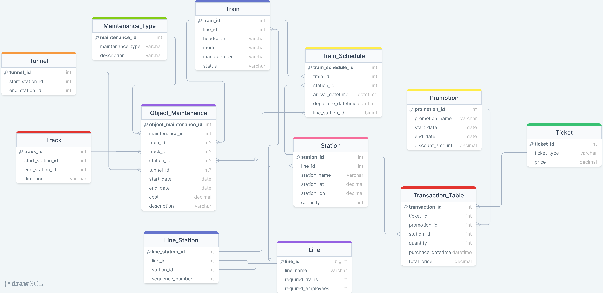

# Subway/Metro System Database Project

This project consists of a physical and a logical database model for a subway/metro system. The database is organized in third normal form (3NF), designed to be realistic.

## ER Diagram

Here's what each file represents:

- **Subway_Database_Descriptions.docx:** This file contains detailed descriptions of the business model, including database tables, columns, and other relevant information.

- **ER_diagram.png:** This file is an Entity Relationship (ER) diagram, providing a visual representation of the database structure.

## Scripts:

- **setup_database.sql:** This script sets up the entire database from scratch. It creates the necessary tables, establishes relationships between them, and applies constraints to maintain data integrity.

- **insert_sample_data.sql:** This script inserts sample data into the tables, including station names, line details, and other relevant information. Each record is inserted with consideration of constraints, and without hardcoding ID values, ensuring relevant connections between data.

- **check_data_quality.sql:** This script performs a thorough check on the inserted data to ensure everything is working as intended. It verifies that all records are correctly inserted and adhering to the defined constraints.
